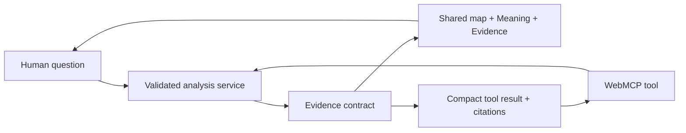

# Sky to Porch WebMCP

Sky to Porch turns official environmental observations into evidence a person
can inspect with an AI agent on the same map and evidence panel.

**Live application:** [sky-to-porch-webmcp.vercel.app](https://sky-to-porch-webmcp.vercel.app/)

## Judge quick start

No Sky to Porch account, login, or API key is required. Open the live
application in ChatGPT's in-app browser, which supports WebMCP by default, or
in Google Chrome 149+ after enabling `chrome://flags/#enable-webmcp-testing`
and restarting Chrome. The human map and evidence workflow also remains usable
in browsers without WebMCP; only the Agent tools require a compatible browser.

1. Ask the page Agent: **“Run the Houston Beryl roof demo.”** The Agent should
   call the analysis tool and update the visible map, Meaning, and Evidence
   panels with separate wind and flood evidence chains.
2. Ask: **“Inspect the exact observations and citations.”** The contextual
   inspection tool should read the active result without rerunning it.
3. To check the location-safety boundary, ask: **“Check wildfire evidence for
   Springfield.”** The tool should return the matching places, and the Agent
   must ask which Springfield you mean and wait for your reply. It must not
   choose a candidate on its own. Reply **“Springfield, Illinois.”** The Agent
   should then resume the unfinished task, call the analysis tool with that
   selected candidate, and continue through the evidence result and shared UI
   update.

The Agent is supplied by the judge's compatible browser. Sky to Porch does not
send judge prompts to an internal model provider and the Vercel deployment does
not need an `OPENAI_API_KEY`.

It helps answer three practical questions:

- **What was officially observed here and when?**
- **How strongly does that evidence support my concern?**
- **What property- or person-specific evidence could change the assessment?**

This repository adds WebMCP to the existing Sky to Porch product. Imported
functionality and new challenge work remain separated in
[PRIOR_WORK.md](PRIOR_WORK.md).

## Product experience

- Ask about any supported place, historical date, hazard, radius, and optional
  concern.
- Receive the strongest supported assessment first, followed by observation
  values, times, official citations, labelled inference, and confidence.
- See the Agent update the same map, Meaning panel, and Evidence panel used by
  the human workflow.
- Inspect related environmental evidence without merging unlike observations
  into one measurement.
- Continue with contextual tools only when the current result makes them useful.

## Curated demo entrances

| Say to the Agent | Historical concern | Evidence chains |
| --- | --- | --- |
| “Run the Houston Beryl roof demo.” | Missing shingles and a new roof leak on July 8, 2024 | Wind & Storm + Flood & Heavy Rain |
| “Run the Los Angeles fire and health demo.” | Coughing and eye irritation on January 9, 2025 | Fire & Smoke + Air Quality |
| “Run the Tucson dog and heat demo.” | Unusual lethargy after outdoor time on July 10, 2025 | Extreme Heat + Drought & Land |

The no-input list tool returns compact, ready analysis inputs for all three
demos in one response. Demo scenarios are curated inputs, not hard-coded
answer paths or guessable selector IDs.

### Ask your own question

For example:

> What official fire and smoke observations were recorded within 30 km of
> Albuquerque, New Mexico, on May 20, 2025?

This non-demo journey uses a different city, date, hazard, and radius from all
three curated scenarios. It omits `concern`, receives the neutral `general`
fallback, updates the visible UI, opens Evidence, and inspects structured
citations. All seven hazard families also have non-demo selection cases.

When a concern is obvious, the Agent can supply it. When a broad goal materially
depends on the concern, the Agent asks one short follow-up. Otherwise, analysis
proceeds without forcing the person to use demo-shaped language.

## WebMCP tools

| Tool | Natural trigger | Human-page effect |
| --- | --- | --- |
| `analyze_environmental_hazard` | A concrete place-and-hazard question | Updates the map, Meaning, Evidence, and Agent receipt |
| `list_environmental_hazards` | Capability discovery or explicit demo selection | None; read-only catalog |
| `get_environmental_source_coverage` | Source, region, or date eligibility | None; read-only coverage, not an observation |
| `inspect_current_environmental_evidence` | A completed analysis needs exact values or citations | Reads the active result without a new query |
| `prepare_storm_claim_discussion` | A completed Home + Wind analysis | Opens an evidence and property-document checklist |

Concrete questions go directly to analysis. Discovery tools are not mandatory
preflight calls. Contextual tools appear only when their required result exists.
Analysis requires an explicit `time`: `latest_completed`, one completed UTC
date, or a bounded date range. Named places are geocoded by deterministic
application code; the Agent cannot supply guessed latitude/longitude fields.

The browser registration entry point is
[`src/components/webmcp/webmcp-bridge.tsx`](src/components/webmcp/webmcp-bridge.tsx).
It registers the baseline and contextual tools against the same
`runAnalysis`/`runAnalysisBundle` controller used by the human interface. The
primary tool definition and compact result shaping live in
[`src/lib/webmcp/analyze-tool.ts`](src/lib/webmcp/analyze-tool.ts).

## Shared evidence flow



Deterministic application code owns location and time validation, source
coverage, retrieval, schema checks, calculations, freshness, provenance,
limitations, and whether evidence is safe to present. No internal model key is
required for evidence retrieval.

## Related evidence

Related context is the default for broad questions. An explicitly narrow
question uses `single_hazard_only`.

| Primary evidence | Related evidence available by default |
| --- | --- |
| Wind & Storm | Flood & Heavy Rain |
| Extreme Heat | Drought & Land |
| Fire & Smoke | Air Quality |
| Earth & Volcanoes | Air Quality + Extreme Heat |

Each chain retains its own source, observation time, coverage, freshness,
confidence, citations, and limitations. The result distinguishes direct
observations from an evidence-supported inference and reports the confidence of
that assessment.

## Verification

| Layer | Current evidence |
| --- | --- |
| Deterministic product | Unit, integration, production-build, and desktop/mobile Playwright gates |
| Native WebMCP | Exact `c6f3c8c` production discovery, analysis, shared UI, no-observation, and contextual tools pass; contextual inspection is within 2,400 characters. A newly exposed primary-bundle cap fix and stronger ambiguous-place STOP/wait contract pass the full local gate and await publication/recheck |
| Historical official sources | All six primary and related chains in the three curated demos returned observations |
| Generic product path | Albuquerque non-demo browser journey plus selection cases across all seven hazards |
| Tool selection | Every registered tool has a distinct natural-trigger case; repeated model-scored runs, including the post-ambiguity wait behavior, remain a separate evaluation gate |

Evidence records:

- [Native Agent acceptance](docs/testing/native-agent-acceptance-2026-08-27.md)
- [Production native Agent verification](docs/testing/native-agent-production-verification-2026-08-27.md)
- [Evidence-forward historical demos](docs/testing/evidence-forward-demo-live-verification-2026-08-27.md)
- [WebMCP evaluation boundary](docs/testing/webmcp-evals.md)
- [Target architecture](docs/architecture/webmcp-target.md)

## Evidence boundary

- Sky to Porch is public-information software, not an alerting or emergency
  decision system.
- A valid observation, no observation returned, source failure, unsupported
  coverage, stale data, and inconclusive evidence remain distinct states.
- Regional evidence can support a confidence-labelled assessment; applying it
  to one property or person depends on property- or person-specific evidence.
- The product does not issue evacuation decisions or predict earthquake or
  eruption timing.
- Official alerts and local authorities remain authoritative.

## Local development

Requirements: Node.js 22 and npm.

```bash
npm ci
npm run dev
```

Open `http://localhost:3000`.

Run the full deterministic gate:

```bash
npm run verify
```

Live-source smoke scripts remain separate and may require network authorization
or source-specific credentials. Deterministic development and fixture tests do
not require an internal model credential. See [.env.example](.env.example).

The optional model-scored WebMCP evaluation is a development-only gate. It can
use `OPENAI_API_KEY` from the gitignored `.env.local`, but that key is never
needed by the application or its deployed WebMCP tools:

```bash
npm run eval:webmcp:model -- --runs 3 --include-post-tool
```

## Attribution and license

Sky to Porch existed before the WebMCP Challenge. The original history,
baseline commit, imported boundary, and material tool assistance are disclosed
in [PRIOR_WORK.md](PRIOR_WORK.md).

Code is licensed under the [Apache License 2.0](LICENSE). External observations
and datasets remain subject to their publishers’ terms; see [NOTICE](NOTICE).
