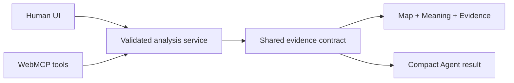

# Sky to Porch WebMCP

Sky to Porch turns official environmental observations into evidence that a
person and an AI Agent can investigate together on the same map.

**Live:** [sky-to-porch-webmcp.vercel.app](https://sky-to-porch-webmcp.vercel.app/)

## Why I built this

After a storm, wildfire, heat wave, or earthquake, people rarely ask for a
dataset. They ask whether something actually happened near them, what the
evidence supports, and what is still unknown.

Official data is scattered across maps, stations, imagery, event reports, and
agency archives. Sky to Porch brings those observations into one inspectable
evidence chain without pretending that regional data proves property damage,
personal exposure, or safety.

## The product before WebMCP

The original Sky to Porch already lets a person select a place, date, radius,
hazard, and concern, then inspect seven environmental evidence families:

- Fire & Smoke
- Flood & Heavy Rain
- Wind & Storm
- Extreme Heat
- Air Quality
- Drought & Land
- Earth & Volcanoes

Its shared map, **Meaning**, and **Evidence** panels connect official
observations to a plain-language assessment, confidence, citations, source
status, and limitations. Imported product work and WebMCP Challenge work are
separated in [PRIOR_WORK.md](PRIOR_WORK.md).

## What WebMCP adds

WebMCP makes the visible product a workspace the person and Agent can operate
together. The Agent can:

- translate a natural question into validated place, time, radius, hazard, and
  concern inputs;
- run every relevant evidence chain instead of forcing the person to repeat the
  form hazard by hazard;
- treat an unqualified **storm** as two separate investigations—Wind & Storm
  and Flood & Heavy Rain—and report both results;
- preserve every multi-chain result as a visible link in the Agent receipt;
- ask for a place choice when a name is ambiguous, then resume the exact
  unfinished request;
- compare two places or time windows without changing either selected radius;
- inspect exact observations, sources, failures, limitations, and missing
  evidence without rerunning the analysis;
- summarize the validated result in summary-first, plain English while the
  human interface keeps every citation available for inspection.

The Agent does not replace the interface. It removes repetitive operation while
making the evidence easier to inspect. Both paths use the same analysis service
and result contract, and the application needs no site-owned model API key.

## Judge quick start

Open the live site in ChatGPT's in-app browser, or in a WebMCP-compatible
browser. No Sky to Porch account or API key is required.

1. Ask: **“Use this site's MCP tools to check storm information within 50 km
   of Houston, Texas, on July 8, 2024.”** Confirm that the Agent returns and
   links both Wind and Flood results.
2. Ask: **“Inspect the exact observations, source status, and citations.”**
   Confirm that this reads the active result without rerunning it.
3. Ask: **“Compare that with the same 50 km area on July 7, 2024.”** Confirm
   that both scenarios and all requested chains remain visible.
4. Ask: **“Check wildfire evidence for Springfield.”** Confirm that the Agent
   waits for a specific place instead of guessing, then resumes after a choice.

The normal human map workflow remains functional in browsers without WebMCP.

## Complete demo journeys

| Ask the Agent | What it demonstrates |
| --- | --- |
| “Check storm information within 50 km of Houston, Texas, on July 8, 2024.” | One broad request runs separate Wind and Flood chains around Hurricane Beryl; an observation in one chain is not erased by a no-observation result in the other. |
| “Run the Houston Beryl roof demo.” | Historical wind, hurricane-track, event-report, rain, flood, and gauge evidence remains claim-separated around a property concern. |
| “Run the Los Angeles fire and health demo.” | Fire detections, smoke, incident perimeters, aerosol, and ground air-quality evidence remain separate from person-specific health conclusions. |
| “Run the Tucson dog and heat demo.” | Heat observations and drought/land context are investigated together without turning environmental data into a veterinary diagnosis. |
| “Check Earth & Volcanoes within 100 km of Hawaiʻi Volcanoes National Park on December 23, 2024.” | Earthquakes, volcano notices, eruption history, and satellite SO₂ are distinct observations; the product does not predict eruptions. |
| “Check Drought & Land within 50 km of Toronto on August 28, 2026.” | Global station/imagery routing and the Canadian Drought Monitor honor the exact selected area. |

## WebMCP tools

| Tool | Purpose |
| --- | --- |
| `analyze_environmental_hazard` | Runs one validated investigation or a complete related-hazard bundle and updates the shared UI. |
| `compare_environmental_evidence` | Compares two independently specified scenarios and retains every result. |
| `inspect_current_environmental_evidence` | Reads the active summary, observations, sources, limitations, or evidence gaps. |
| `get_environmental_source_coverage` | Explains whether a source is eligible for a region and date; it is not itself an observation. |
| `get_sky_to_porch_help_and_demos` | Returns capabilities and ready-to-run demo inputs. |
| `prepare_storm_claim_discussion` | Opens a bounded evidence and property-document checklist after a Home + Wind result. |

Concrete questions go directly to analysis. Named places are resolved by
deterministic application code; the Agent cannot inject guessed coordinates.
Every user-specified radius remains authoritative.

## Evidence and engineering



Deterministic code owns location and time validation, source coverage,
retrieval, schema checks, calculations, freshness, provenance, limitations,
confidence, and whether a claim is safe to present. The Agent chooses tools and
explains only the validated result.

The evidence layer now includes bounded adapters for NOAA NCEI Storm Events,
NWS Local Storm Reports, NHC HURDAT2, NOAA Global Historical Climatology
Network hourly stations, NOAA MRMS current rolling 24-hour QPE, NIFC WFIGS perimeters, EPA AQS,
Smithsonian GVP, USGS earthquake and volcano feeds, the Canadian Drought
Monitor, plus the existing NASA, NOAA, USGS, AirNow, and Canadian hydrometric
sources.

Important engineering boundaries:

- exact selected geometry and requested dates are checked before an
  observation is accepted;
- source downloads, decompression, record counts, and response sizes are
  bounded;
- numeric precipitation is reported only when an official source returns a
  finite validated value—an imagery pixel is never relabelled as millimetres;
- optional sources retain their no-observation, failure, and credential states
  without weakening supported core evidence;
- EPA AQS credentials remain server-only and are never written to provenance;
- valid observation, no observation, source failure, unsupported coverage,
  stale data, inconclusive evidence, and no active alert remain distinct.

The browser registration entry point is
[`src/components/webmcp/webmcp-bridge.tsx`](src/components/webmcp/webmcp-bridge.tsx);
tool contracts and compact outputs live under
[`src/lib/webmcp`](src/lib/webmcp), and the source catalog is documented in
[`src/data/dataset-registry.ts`](src/data/dataset-registry.ts).

## Verification

`npm run verify` runs type checking, lint, unit tests, integration tests,
production build, desktop/mobile browser journeys, and the secret gate.
Live-source smoke checks and optional model-scored tool-selection evaluations
remain separate so fixture success is never presented as live-source proof.
The 2026-08-30 expanded evidence-chain record is local deterministic and local
live-source evidence. Those expansion journeys have not been separately
verified in production.

Key records:

- [NCEI streamed-archive OOM verification](docs/testing/ncei-streaming-oom-verification-2026-09-03.md)
- [Expanded evidence-chain local/live-source verification](docs/testing/evidence-chain-expansion-live-verification-2026-08-30.md)
- [Native Agent acceptance](docs/testing/native-agent-acceptance-2026-08-27.md)
- [Production Agent verification](docs/testing/native-agent-production-verification-2026-08-27.md)
- [Historical demo verification](docs/testing/evidence-forward-demo-live-verification-2026-08-27.md)
- [WebMCP evaluation boundary](docs/testing/webmcp-evals.md)
- [Target architecture](docs/architecture/webmcp-target.md)

## Evidence boundary

Sky to Porch is public-information software, not an alerting or emergency
decision system. Regional evidence does not establish property damage,
personal exposure, route safety, medical diagnosis, or insurance outcome. The
product does not issue evacuation decisions or predict earthquakes or eruption
timing. Official alerts and local authorities remain authoritative.

## Local development

Requires Node.js 22 and npm.

```bash
npm ci
npm run dev
npm run verify
```

Deterministic development requires no model credential. Optional source keys
and their closed-gate behavior are documented in [.env.example](.env.example).

## Next

- Add authenticated raw NASA IMERG/SMAP numeric products after access and
  parser gates are reproducible.
- Add deeper NEXRAD archive processing without turning large binary retrievals
  into an unbounded Agent action.
- Activate Canada's CWFIS/CWFIF wildfire source after the official migration
  and replacement schema can be live-validated.
- Continue adding region-specific official sources where current coverage is
  truthful but thin.

## Attribution and license

Sky to Porch existed before the WebMCP Challenge. The original repository,
baseline commit, imported boundary, and material tool assistance are disclosed
in [PRIOR_WORK.md](PRIOR_WORK.md).

Code is licensed under the [Apache License 2.0](LICENSE). External observations
remain subject to their publishers' terms; see [NOTICE](NOTICE).
